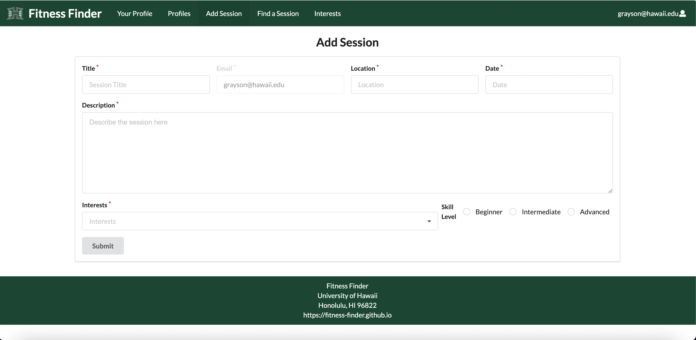

Welcome to the Fitness Finder home page!

## Table of contents

* [Overview](#overview)
* [User Guide](#user-guide)
* [Developer Guide](#developer-guide)
* [Deployment](#deployment)
* [Development History](#development-history)
* [Organization](#organization)
* [Team](#team)
## Overview

### Problem: 

UH students often find it difficult to find people to workout with or group fitness activities to join. Many convince their friends to join only to have them bail last minute. Those that enjoy working out with others may just end up not working out. This leads to poor fitness and health.

### Solution:

Our solution to this is the “Fitness Finder” website which helps connect the UH community together and offers opportunities to meet new people and join group activities with other students that would otherwise be hard to find.

### Description

Fitness Finder is a website that UH students can use to find fitness-related activities as well as workout buddies in their area. Whether you are a beginner or a pro, Fitness Finder allows you to broaden your fitness horizons. The main focus of this website is to be able to create a community of students who are interested in furthering their fitness journeys and provide a safe space for them to connect with one another. Starting with creating a profile, users can list their skill level, fitness-related interests, general location,  a picture of themselves, as well as any additional details they might feel the need to include. Once their profile is created, users can create a group for a specific workout session or activity, post to existing groups, or scroll through groups they are interested in. From swimming to roller skating, users have the option of leaving their comfort zone and trying out something new, or honing the skills they already have with others. There is also the option of being matched up with a random workout buddy/group, in the “Random'' tab. Fitness Friends can be used as a networking tool in order to meet people with similar interests that a user hasn’t met before, as well as a way to try new activities that a user may not have thought was available to them. Any important events or workshops will be noted on the calendar.


## User Guide

### Landing page

The first thing users see when using the URl for the site.


### Profile page

The profiiles page shows user profiles and shows their interest, their associated sessions, and which sessions they have joined.


### Your Profile page

After creating their profile, your profile page shows your current profile, and is capable of updating your profile.


### Find a session page

Find a session page shows sessions that are available to join. Users can see a description of the session, who made the session, any participants for that session, and are able to join sessions from this page.


### Add a session

Add a session page allows users to create their own session.




## Developer Guide

### Installation
First, install [Meteor](https://www.meteor.com/install).

Next, go to the [Fitness Finder application github page](https://github.com/fitness-finder/fitness-finder) and make a copy of the repo to your local computer.

Then, cd into the fitness-finder/app directory and use:

```
meteor npm install
```

And finally, run the system with:

```
meteor npm run start
```

If everything is good, the application will appear at [http://localhost:3000](http://localhost:3000).


## Deployment:

Our App can be accessed [here](https://fitness-finder.xyz/#/). While still in progress this is our most current version.

## Development History

The development process for fitness finder conformed to [Issue Driven Project Management](http://courses.ics.hawaii.edu/ics314f19/modules/project-management/) practices. In a nutshell:

* Development consists of a sequence of Milestones.
* Each Milestone is specified as a set of tasks.
* Each task is described using a GitHub Issue, and is assigned to a single developer to complete.
* Tasks should typically consist of work that can be completed in 2-4 days.
* The work for each task is accomplished with a git branch named "issue-XX", where XX is replaced by the issue number.
* When a task is complete, its corresponding issue is closed and its corresponding git branch is merged into master.
* The state (todo, in progress, complete) of each task for a milestone is managed using a GitHub Project Board.

The following sections document the development history of fitness finder.

### Milestone 1: Mockup development
[M1 Project board](https://github.com/fitness-finder/fitness-finder/projects/1)
### Milestone 2: Data model development
[M2 Project Board](https://github.com/fitness-finder/fitness-finder/projects/2)
### Milestone 3: Final touches

## Example enhancements

* Implement a text mesasge interface
* Implement an “I’m feeling lucky button” where the user is given a random public session as a suggestion for a given time
* When creating a workout session the creator has an option to make it public or private, allowing them to choose who can see it or not

## Organization

This project has been created under the organization Fitness Finder. [Check us out!](https://github.com/fitness-finder)

## Team

[Team contract](https://docs.google.com/document/d/1m8LsO8nmDOwIHj3Ud4k8p5zBMpd8c0i3dL2BMquQafE/edit)

fitness finder is designed, implemented, and maintained by [Grayson Levy](https://glevy94.github.io), [Tanner Young](https://tanner-ky.github.io), [Nika Yadav](https://bhavanikay.github.io/), [Devin Arquines](https://darquines.github.io).


